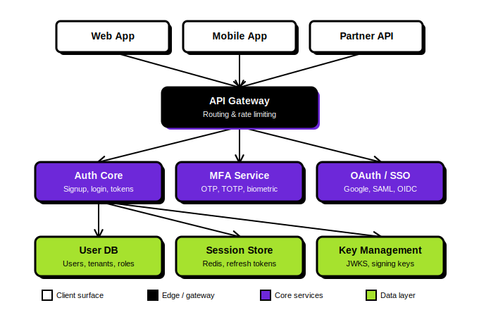
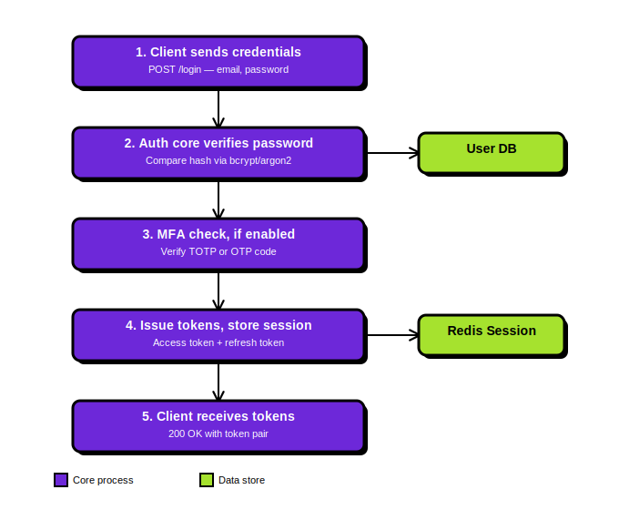

# Keystone

**Authentication-as-a-Service for developers who'd rather ship than build auth from scratch.**

🚧 **Status: actively in development** — currently building out the core auth API and the homepage UI.

Keystone is a secure login system other apps can plug into instead of building their own. It handles sign-up/sign-in, two-factor authentication, and social/enterprise login (Google, SAML, OIDC) — with multi-tenant support so one Keystone instance can serve many customer apps at once.

---

## ✨ Features

- **Email/password auth** — signup, login, password reset
- **Multi-factor authentication** — TOTP, SMS/email OTP, WebAuthn/biometric
- **OAuth & SSO federation** — Google, SAML, OIDC
- **Multi-tenant workspaces** — isolate each customer's users by design
- **JWT access tokens + rotating refresh tokens** — short-lived access, long-lived rotation with revocation
- **Automatic key rotation** — JWKS signing keys rotate without downtime
- **Audit logging** — every login and account change is timestamped and exportable
- **Rate limiting** — built-in protection against credential stuffing

---

## 🏗 Architecture


Requests flow from client apps through an API gateway into the core services (auth, MFA, OAuth/SSO), which read and write to the data layer — a user database, a Redis-backed session store, and a key management service exposing a JWKS endpoint.

---

## 🔐 How Login Works


1. Client submits credentials to `/login`
2. Auth core verifies the password against its hash (Argon2id)
3. If MFA is enabled, the user completes a TOTP/OTP challenge
4. Keystone issues a short-lived JWT access token and a rotating refresh token, storing the session in Redis
5. Client receives the token pair and uses the access token on subsequent requests

---

## 🎨 Design System

The homepage UI uses a high-contrast, neobrutalist palette:

| Token | Hex | Used for |
|---|---|---|
| Black | `#000000` | Borders, hard shadows, gateway/edge surfaces |
| White | `#FFFFFF` | Primary text on dark surfaces, client-facing UI |
| Violet | `#6D28D9` | Primary accent — CTAs, core service highlights |
| Lima | `#A6E22E` | Secondary accent — live/active states, data layer |

Fonts: **Space Grotesk** (headlines) · **Plus Jakarta Sans** (body) · **JetBrains Mono** (code, stats, terminal output)

---

## 🛠 Tech Stack

**Frontend:** React, Vite, vanilla CSS
**Backend (planned):** Node.js, PostgreSQL, Redis
**Auth internals:** JWT (HS256) + opaque rotating refresh tokens, JWKS key rotation, Argon2id password hashing

---

## 📂 Project Structure

```
keystone/
├── src/
│   ├── components/
│   │   ├── RetroWindow.jsx
│   │   ├── HeroMockup.jsx
│   │   ├── CodePreview.jsx
│   │   ├── PricingCard.jsx
│   │   └── Panel.jsx
│   ├── assets/
│   │   └── Shapes.jsx
│   ├── App.jsx
│   └── index.css
├── diagrams/
│   ├── architecture-diagram.svg
│   └── auth-flow-diagram.svg
└── index.html
```

---

## 🚧 Roadmap

- [x] Homepage UI design & implementation plan
- [ ] Core auth API (signup, login, token issuance)
- [ ] MFA service
- [ ] OAuth/SSO connectors
- [ ] Admin dashboard
- [ ] Audit log export

---

## 🚀 Getting Started

```bash
git clone https://github.com/<your-username>/keystone.git
cd keystone
npm install
npm run dev
```

---





